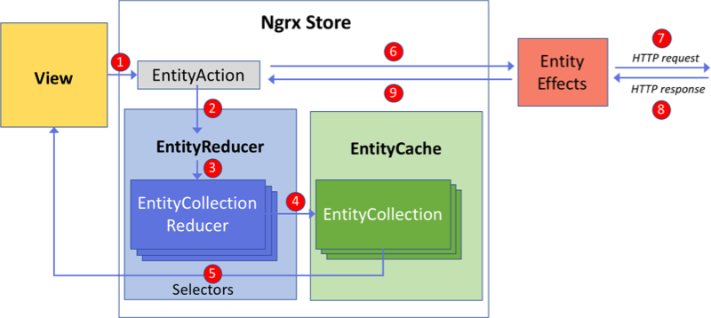

# NgRx - Quick start

## Fundamentals and basics

### Prerequisites

To use NgRx efficiently, you must be familiar with RxJS at least on a basic level. You should know the basic operators and understand marble diagrams (to be able to understand the RxJS docs).

### What is NgRx?

NgRx is an implementation of the Flux pattern in Angular, powered by RxJS. It aims to bring reactive extensions to Angular. So, first things firs, we need to go through the Flux pattern.

### Why you should use Flux/NgRx

As the Web Framworks and SPA applications have evolved, they become more and more complex. Inside our Single Page Applications we have to handle a lot of state info, we have to handle data that is coming from the server, or data that is created by our application and not yet persisted, or data that is only about our UI.

> Managing this ever-changing state is hard. If a model can update another model, then a view can update a model, which updates another model, and this, in turn, might cause another view to update. At some point, you no longer understand what happens in your app as you have lost control over the when, why, and how of its state. When a system is opaque and non-deterministic, it's hard to reproduce bugs or add new features.

Handling the state is becoming even more complex when we add asynchornicity to the mix. Because now, you don't even know when is a certain update is happening. It becomes incredibly hard to predict, what is happening in out Application State when something happens in the system. Hence, it will be more and more challanging to find and fix bugs, or add new features without any degradation.

### Principles of Flux/NgRx

**Unidirectional Data flow**

Inside NgRx and the Flux pattern, the data-flow for our everchanging state is unidirectional. This will make it easy for us to follow the data along the way and predict the state changes.

**Single sourceof truth**

The global state of our application must be stored in one object tree, inside a single **store**. This will be our Single Source of Truth. With this single source of truth we can be confident, that we are showing the up-to-date state of the application. It is also easier to debug our application with this, we can log out how the application's state changed over time. Also, it enables us to implement functionality which is traditionally difficult, like Undo/Redo.

**Read-only state**

We can only change the state if we're emiting an **action**, which is an object that is describing what happend, what is our intent. With this rule, we can be sure that neither views nor network callback will ever change the state directly. Since we're centralazing our changes, and we make sure that they are happening one by one in a strict order, we don't have to be afraid of race conditions. Also, since actions are plain object, we can log or even store them for debugging purposes. We can even replay them later.

**Change the state by pure functions**

We need to specify the transformations between states with pure functions, called reducers. Pure functions are simply functions that aren't dependant to anything outside their context. The return value of a pure function will always be the same if you call it with the same parameters. We are changing the state with simple functions, so we can control the order in which they are called easily, also, we don't have to deal with asynchronicity here.

### Building Blocks of NgRx

Since NgRx is an implementation of the Flux pattern it is built from the same building blocks. For now, I'll just run through them, I'll be coming back with a full fetched example later.

    
    

        Action flow of NgRx
    

Above you can see the flow of Actions and data inside NgRx. We will cover every part of it in the next sections. One thing to notice though is that the dataflow is unidirectional, altough a bit more complex. The numbers are representing the order of the flow of our data. This will always be the same, this is what makes this pattern so much more predictible.

### Actions

Actions are plain JavaScript objects with a type attribute, that is used to identify an action. It is usually a short description about the intent of the action itself. There are no other restrictions or rules for the Action objects.

### Reducer

As I said before, the reducer is a pure function, describing the transitions between states. It receives the current state object and the action, then calculates the new state, which will be changed in an immutable way.

### Store

The Store is the single source of truth. It is provided as a service within Angular, when we're importing NgRx's StoreModule. We can access the state of our application with this service. The Store service, to put it simply, is a special kind of Observable. Which will emit our state objects as our App State is changing. Also, there is a dispatch method on it which is used to send actions to the reducers and effects.

### Effects

Effects are something we haven't covered in our brief Flux description. We can use them to perform side effects when they are needed. A side effect can be the call of a service request or just a simple notification. Since the reducers are synchron and pure functions, we cannot call network requests from there, so we have to use Effects for this purpose.

### Selectors

Selectors are simple, pure functions, that can be used to select part of our application's state. Selectors will get the state object and return some value. This value is not restricted, as far as the selector function remains pure. This, means that we can even make some more complex calculations on our state object. For example, if we have a list of entites, we can return the number of our list for pagination, or even count specific type of entities. Thus, selectors are very highly reusable parts of NgRx.
