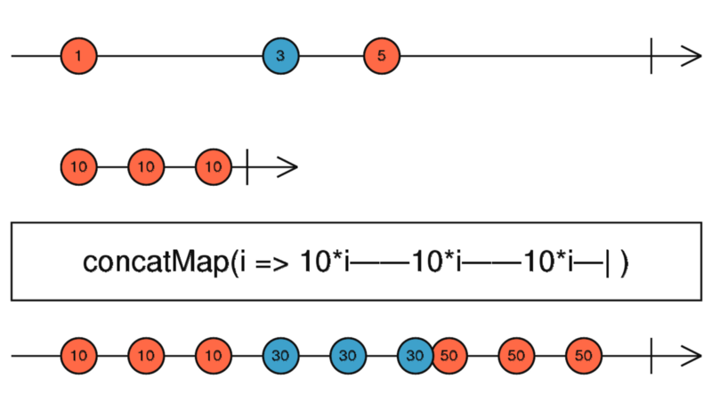

# The Operator of the Day: The concatMap
It'll keep the bugs away!

## Intro

I've started this series of articles to go through every operator, creational, and others inside RxJS. Although I used and know a lot of them, I don't know every last one of them. A lot of times, I realize that there would be a much more cleaner or shorter way of doing things if I would just know that one operator. I wanted to keep these articles short, but meaningful with several examples, so I decided to go with one operator per article.

## The basics

Let's see what the docs say about today's operator, the **concatMap**.

> Projects each source value to an Observable which is merged in the output Observable, in a serialized fashion waiting for each one to complete before merging the next.

<div align="center">
    
    <p>
        ConcatMap marble diagram
    </p>
</div>

As you can see from the marble diagram and the docs, also probably guessed it from the name, this operator is used to concat other so-called inner observables to the source. The keyword here is the concat. You must not forget that this operator will wait for every inner Observable to finish, before starting the new one. This behavior is sometimes desirable, but other times it is not. Let's see some examples:

```ts
it('should process every value, wait for the inner Observable to finish before processing the next one', () => {
  testScheduler.run((helpers) => {
    const { cold, expectObservable } = helpers;
    const source = cold('-a---b-----c----|', { a: 1, b: 3, c: 5 });
    const inner =  cold('a-b-c-|', { a: 10, b: 10, c: 10 });
    const expected =    '-a-a-a-b-b-b-c-c-c-|';

    const concated = source.pipe(
      concatMap((value) =>
        inner.pipe(map((innerValue) => value * innerValue))
      )
    );

    expectObservable(concated).toBe(expected, {
      a: 10,
      b: 30,
      c: 50,
    });
  });
});
```

First, let's see the same example as the one written by marbles on RxJS's site. I used marble testing to create code samples, I find it a great visual way to represent how operators are working.

The first thing that you may notice is that the pattern (the marble) of the inner observable can be seen in the expected output observable. This should be something you expect since the docs also say that the concatMap will wait for the inner Observable to finish before processing the next emitted value. This also means that it will wait for it to complete.

```ts
it(`should never emit any value if the inner observable doesn't emit anything nor completes`, () => {
  testScheduler.run((helpers) => {
    const { cold, hot, expectObservable } = helpers;
    const source = cold('-a---b-----c----|', { a: 1, b: 3, c: 5 });
    const inner =   hot('---');
    const expected =    '------------------------';

    const concated = source.pipe(
      concatMap((value) => inner.pipe(map(() => value * 10)))
    );

    expectObservable(concated).toBe(expected);
  });
});
```

The above example shows, that if I make the inner observable a hot observable instead, which is not completing at all, our output observable would be much longer or it wouldn't even complete or emit values. This can be a source of confusion. For example, you may concatMap a stream of events into your source observable and that event just happens to be not raised at all, then your output observable would never emit any value, nor complete.

```ts
it(`should never emit any value if the inner observable is hot and only emits values before the first source value arrives`, () => {
  testScheduler.run((helpers) => {
    const { cold, hot, expectObservable } = helpers;
    const source = cold('---------a|', { a: 1, b: 3, c: 5 });
    const inner =   hot('---a|', { a: 10 });
    const expected =    '----------|';

    const concated = source.pipe(
      concatMap((value) => inner.pipe(map(() => value * 10)))
    );

    concated.subscribe((val) => console.log(val));

    expectObservable(concated).toBe(expected);
  });
});
```

A similar issue can raise if you concatMap to an inner observable, which is hot and albeit completes, it is completing and emitting values before any value is coming on your source Observable. This will result in an empty stream, which doesn't emit any value no matter how many values are coming from the source.

## Summary

**DO** use the concatMap operator, when:
  * You want to map to an inner observable, which is cold and you are sure that it will complete.
  * You want to map your Observable to a not recurring HTTP request. (The "not recurring" part is important here because the concatMap will wait for every inner observable to complete)

**BE CAUTIOUS**, when using the concatMap operator, if:
  * You concatMap to an inner observable, that represents a recurring HTTP request. Oftentimes, you want to cancel the old HTTP request, when a new value arrives. So make sure, you want to handle every value emitted by the source observable via HTTP in this case.

**AVOID**, using the concatMap operator, when:
  * You have to map to a hot observable, that you couldn't control. Like a stream of Events or a Subject that you couldn't complete or you don't know when it completes.
  * You have to map to an inner observable, which completes slower than your source observable emit the values. Since it is waiting for every inner observable to complete, this can lead to memory/performance problems.
