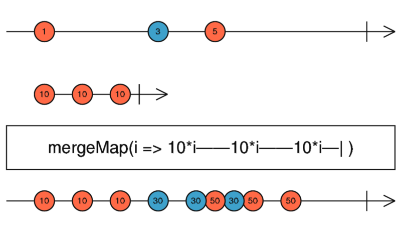

# The Operator of the Day: The mergeMap

An introductory guide to the mergeMap operator in RxJS, along with its DOs and DON'Ts.

## Intro

We covered the concatMap and the switchMap, let's continue with the mergeMap. As always, we're going to go through some examples, which are showing the edge cases of this operator, then I try to summarize the article with some DOs and DON'Ts.

## The Basics

As always let's start at the RxJS docs and look at the definition and the basic example.

> Projects each source value to an Observable which is merged in the output Observable.

<div align="center">
    
    <p>
        MergeMap marble diagram
    </p>
</div>

This operator again is used to connect two or more observables. This one, as the name implies, will merge the inner observables into one output observable. This means, that all of the inner observables will emit their values as they arrive, thus source values may not be processed in the same order as they arrived. This can be seen on the marble at the blue '30' values. The last one arrives a bit later than the first '50' value. This operator is much like switchMap and concatMap, the difference again is the way it handles the inner observables.

## Examples & Edge cases

Once again, let's start with recreating the example of the docs site.

```ts
it(`should emit all of the values of the inner observable,
    regardless of the source's pace.`, () => {
  testScheduler.run((helpers) => {
    const { cold, expectObservable } = helpers;
    const source = cold("-a--b----c----|", { a: 1, b: 3, c: 5 });
    const inner = cold("  a-b-c|", { a: 10, b: 10, c: 10 });
    const expected = "   -a-abab-bc-c-c|";

    const merged = source.pipe(
      mergeMap((value) => inner.pipe(map((innerValue) => value * innerValue)))
    );

    expectObservable(merged).toBe(expected, { a: 10, b: 30, c: 50 });
  });
});
```

As I said, the mergeMap operator is very similar to switchMap and concatMap. **The difference is in the way it handles the inner observables.** This operator is not doing anything special with the inner observables, it is not waiting for any of them to complete before starting to the next inner observable, nor cancel any of them. **It is basically subscribing to each and every inner observable and forwarding the values coming from them to the output observable.**

One of the implications of this is that the order of the source observable may not be kept in the output observable. Let's look at an example.

```ts
it(`should not wait for any of the inner observables to complete,
  before starting a new one, nor cancel them`, () => {
  testScheduler.run((helpers) => {
    const { cold, expectObservable } = helpers;
    const source = cold("-a--b----c----|", { a: 1, b: 3, c: 5 });
    const slow = cold("   -----------a|", { a: 10 });
    const fast = cold("      -a|", { a: 10 });
    const expected = "   -----b----c-a-|";

    const merged = source.pipe(
      mergeMap((value) => {
        if (value === 1) {
          return slow.pipe(map((innerValue) => innerValue * value));
        } else {
          return fast.pipe(map((innerValue) => innerValue * value));
        }
      })
    );

    expectObservable(merged).toBe(expected, { a: 10, b: 30, c: 50 });
  });
});
```

As you can see, the order of the source values is not kept. I intentionally made the processing of the first source value really slow but made the second and third inner observable fast. This way, even though the value '1' arrived first, it was processed last, and value '10' arrived as the last value of the output observable. A real-world example would be, yet again an HTTP request, you cannot really control the speed of a request and in the case of the mergeMap if one of them takes longer, then it may happen that it will arrive later than one of the newer values. This is not a problem in some cases, maybe you are not interested in the results or you handle every result by its timestamp. However, it can pose a problem if you actually show these results, in that case, you may show outdated data to the user.

```ts
it(`should never complete, if one of the inner observables are not completing`, () => {
  testScheduler.run((helpers) => {
    const { cold, expectObservable } = helpers;
    const source = cold("      -a--b----c----|", { a: 1, b: 3, c: 5 });
    const nonCompleting = cold("-a", { a: 10 });
    const inner = cold("           -a|", { a: 10 });
    const expected = "         --a--b----c----";

    const merged = source.pipe(
      mergeMap((value) => {
        if (value === 1) {
          return nonCompleting.pipe(map((innerValue) => value * innerValue));
        } else {
          return inner.pipe(map((innerValue) => value * innerValue));
        }
      })
    );

    expectObservable(merged).toBe(expected, { a: 10, b: 30, c: 50 });
  });
});
```

In the above example, you can see what happens when one of your inner observables is not completing at all. In the code above, you can see that on the first source value, we merge an inner observable which is not completing, on the second and third emission we merge observables that are completing. Since the mergeMap will not cancel or wait for any inner observables, this will result in an output observable, that may look right, but doesn't complete. This happens because our first inner observable is not completing. This can be really dangerous since other than the completion, there is nothing wrong, so you may think that everything works fine. This can introduce some really hard-to-tackle bugs and even some memory leaks, because if you subscribe to this observable and you expect it to complete, then you may not even bother to unsubscribe, since on completion it should happen automatically.

```ts
it(`should process every source value, when a new value arrives
    on the inner hot observable`, () => {
  testScheduler.run((helpers) => {
    const { cold, hot, expectObservable } = helpers;
    const source = cold("-a--b----c----|", { a: 1, b: 3, c: 5 });
    const inner = hot("  a--a---a-------", { a: 10 });
    const expected = "   ---a---(ab)-";

    const merged = source.pipe(
      mergeMap((value) => inner.pipe(map((innerValue) => value * innerValue)))
    );

    expectObservable(merged).toBe(expected, { a: 10, b: 30 });
  });
});
```

Another interesting edge case is when you mergeMap to an inner observable, which is hot, and it's already started. As you can see in the example, just like in the case of concatMap and switchMap, we're missing the first emission of the hot observable since it arrived sooner than the first value on the source. The interesting part starts when we are getting our values on the source. Since the inner observable is a hot one, and it never completes, when it emits a value all of the former source values will be processed. That is why we get two simultaneous emissions when the third value arrives from our inner observable. The inner observable didn't complete and mergeMap will not unsubscribe from former inner observables, so basically at the time of that third emission, we have two subscriptions. Yet again, this can be useful if you want this to happen, maybe you want to recalculate some values that came from a cold observable when some user event happens, which is emitted by the inner hot observable. However, be aware that you have to unsubscribe from this manually since the inner observable never completes.

## Summary

**DO** use the mergeMap operator, when:

- You want to merge inner observables into one and you are not interested in the order of the processing

**BE CAUTIOUS**, when:
  - you use it to merge a hot observable. Be sure to unsubscribe or use takeUntil to complete your output observable when you need it. Don't forget that mergeMap will subscribe to the inner, hot observable every time your source emits an item.

**AVOID** using the mergeMap operator, when:
  * you want to map to a hot observable and your source emits a lot of items
  * it is important to process the source values in the order of their arrival
