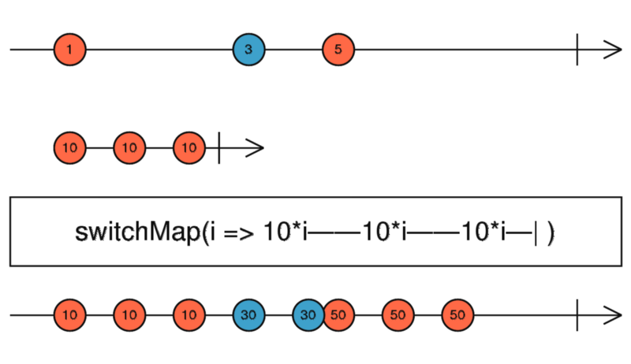

# The Operator of the Day: The switchMap
It'll keep the bugs away!

## Intro

Last time, we started off with the concatMap operator. We checked out how it works and how does it deals with different kinds of observables. Today, we are going to continue with the **switchMap** operator.

## The basics

Like the last time, let's start with checking out the official docs about this one.

> Projects each source value to an Observable which is merged in the output Observable, emitting values only from the most recently projected Observable.

<div align="center">
    
    <p>
        SwitchMap marble diagram
    </p>
</div>

As you may have found out from the description, this operator has a very similar role to the concatMap. You can use this operator to switch to a so-called inner observable. This inner observable will be merged into the output observable.

What is special about this operator is the way this is merged. Unlike the concatMap operator, the **switchMap will not wait for the inner observable to complete. If a new value is emitted from the source observable, and it is projected to a new observable, in other words when a new inner observable arrives, it will switch to that one and will unsubscribe from the older one if it hasn't completed yet.**

This behavior can be useful, but it can be hard to tackle if it is causing some issues and you don't know how exactly this operator is working. Let's see some examples:

```ts
it(`should emit values from the inner observable until a new value arrives on the source,
    then it should switch to the new inner observable`, () => {
  testScheduler.run((helpers) => {
    const { cold, expectObservable } = helpers;
    const source = cold("-a---b----c----|", { a: 1, b: 3, c: 5 });
    const inner = cold("a-b-c|", { a: 10, b: 10, c: 10 });
    const expected = "-a-a-b-b-bc-c-c|";

    const switched = source.pipe(
      switchMap((value) => inner.pipe(map((innerValue) => value * innerValue)))
    );

    expectObservable(switched).toBe(expected, { a: 10, b: 30, c: 50 });
  });
});
```

Like the last time, let's check out the same example as you can see in RxJS's documentation. Once again, I'm using marble testing, because I think it is a great visual way to show how operators are working and a great way to test observables.

You may have already noticed, that there are some similarities to the concatMap. Like, the marble pattern of the inner observable can be seen in the marble of the output observable. However, there are some differences.

Right at the end of the first pattern, you can see that the second value on the source observable comes just when the third and last value would have been emitted by the inner observable. This is where switchMap and concatMap differ, the switchMap will **switch** to the new inner observable immediately and will unsubscribe from the older inner observable.

```ts
it(`should not emit any values if the source values are coming faster,
    then the inner observable starts to emit,
    until the source settles down`, () => {
  testScheduler.run((helpers) => {
    const { cold, expectObservable } = helpers;
    const source = cold('-a-b-c|', { a: 1, b: 3, c: 5 });
    const inner = cold( '--a-b-c|', { a: 10, b: 10, c: 10 });
    const expected =    '-------a-a-a|';

    const switched = source.pipe(
      switchMap((value) =>
        inner.pipe(map((innerValue) => value * innerValue))
      )
    );

    expectObservable(switched).toBe(expected, { a: 50 });
  });
});
```

The above example shows what happens if you switchMap to an observable that is emitting slower than the source.

Basically what happens here is that the inner observable would just emit a value when a new value arrives in the source, thus the switchMap will switch to the new inner observable. In this particular case, the output observable will only emit values once the source observable settles down so the inner observable has time to process values and emit new ones.

This behavior can be an issue if the source does not settles down for a long period of time and it emits values very frequently. Just imagine that the inner observable is some HTTP request, that would mean that we start a new HTTP request on every source value, but they will be canceled until the source settles down.

```ts
it(`should never never complete if the source isn't completing`, () => {
  testScheduler.run((helpers) => {
    const { cold, hot, expectObservable } = helpers;
    const source = hot('-a-b-c---------', { a: 1, b: 3, c: 5 });
    const inner = cold('a-b-c|', { a: 10, b: 10, c: 10 });
    const expected =   '-x-y-z-z-z-----';

    const switched = source.pipe(
      switchMap((value) =>
        inner.pipe(map((innerValue) => value * innerValue))
      )
    );

    expectObservable(switched).toBe(expected, { x: 10, y: 30, z: 50 });
  });
});
```

In this example, I changed the source to a hot observable, which never completes. In this case, the output observable would never complete. I wanted to add this example since this can be quite misleading since apart from the completion everything works just fine, but if we aren't unsubscribe from the output observable, then it will run forever. So, this can be a source of subscription leaks.

Just imagine that the source is some kind of subject from a service. You use it in a component and switchMapping to another inner observable, that happens to be an HTTP request. If you don't unsubscribe from the output when the component got destroyed, then it will continuously run and start those HTTP requests even though the component that created it doesn't even exist. If that same component happens to be created again, then again it will subscribe to it and now you see two HTTP requests going out.

```ts
it(`should emit the further values of the inner observable,
    if that is a hot observable, and should not complete,
    if that inner observable nover completes`, () => {
  testScheduler.run((helpers) => {
    const { cold, hot, expectObservable } = helpers;
    const source = cold('-a---b----c----|', { a: 1, b: 3, c: 5 });
    const expected =    '--x-x';
    const inner = hot(  'a-a-a-----', { a: 10 });

    const switched = source.pipe(
      switchMap((value) =>
        inner.pipe(map((innerValue) => value * innerValue))
      )
    );

    expectObservable(switched).toBe(expected, { x: 10 });
  });
});
```

Let's see what happens if we switch to a hot observable, which is already emitting values before we even start to work with our cold source observable. If you don't know that the inner observable is hot, then the expected marble can be a little bit surprising. Even though we have three values emitted by the inner observable and also three values on our source observable, we only see two values emitted by the output observable.

The reason behind this is that the hot observable starts to emit right after its creation, so we miss its first emit. Then, the first value arrives on our source observable, in that time frame we don't have any values on our inner observable, thus we have an empty '-' there. Then, the inner hot observable emits a value, which we process and it becomes the first emission of the value 10. After that, we have the second value coming from the inner hot observable. Then, we get new values from the source, but since the inner observable is hot it will not "restart" when we switch to it and it doesn't emit any value, so our output observable will not emit any more values.

## Summary

**DO** use the switchMap operator, when:
  * You want to switch to a cold observable and you don't have to process every value from the source
  * You want to cancel the former inner observables as the new ones arrive. This can be useful in case the inner observable is an HTTP request and you don't have to finish the request on every source value

**BE CAUTIOUS**, when using the switchMap operator if:
  * Your source observable emits very frequently and you are not sure when it settles down. Don't forget, that even though the switchMap is canceling every outdated inner observable, it still starts them. For example, if those inner observables are HTTP requests, then all of them will be started and then canceled, which can put some stress on the server.

**AVOID** using the switchMap operator, when:
  * You switch to a hot observable, which you couldn't control. Like a stream of events, or a Subject which you cannot control, or don't know how it emits values.
